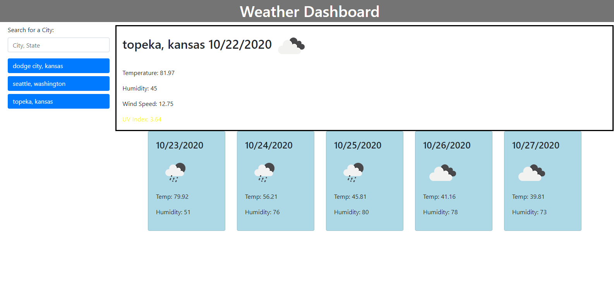

# [06_weather_dashboard](https://millsy4.github.io/06_weather_dashboard/)

This is a website that allows the user to input a city and state and get back the current weather conditions for that city, as well as, the weather conditions for 5 days after that.  It stores the last searched cities and displays it upon page reload, as well as, stores all of the searched cities in buttons that can be clicked to redisplay the information.

Tools I used to complete this include:

- [Javascript](https://www.javascript.com/)

- [Bootstrap](https://getbootstrap.com/)

- [Moment.JS](https://momentjs.com/)

- [Open Weather API](https://openweathermap.org/api)

- [JQuery](https://jquery.com/)

The main objective of this homework was to practice using server side APIs.  We were tasked with accessing the openweathermap.org API and using the information gathered from that API to display on our website.  This information will be extremely helpful later due to how much information can be gathered from APIs.

